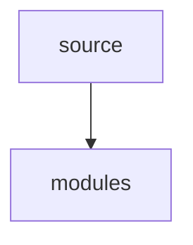

# Architecture — kube-prometheus

> Auto-generated architecture overview. Last updated: 2026-03-20

## Overview

| Property | Value |
|----------|-------|
| **Repository** | GBI-Core/kube-prometheus |
| **Primary Language** | Go |
| **Framework** | github.com/prometheus-operator/kube-prometheus |
| **Default Branch** | main |
| **Has Docker** | No |
| **Has Protobuf** | No |

## Directory Structure

```
kube-prometheus/
├── developer-workspace/
│   ├── codespaces/
│   ├── common/
│   ├── gitpod/
├── docs/
│   ├── customizations/
│   ├── migration-example/
├── examples/
│   ├── basic-auth/
│   ├── continuous-delivery/
│   ├── example-app/
│   ├── jsonnet-build-snippet/
│   ├── jsonnet-snippets/
├── experimental/
│   ├── metrics-server/
├── jsonnet/
│   ├── kube-prometheus/
├── manifests/
│   ├── setup/
├── scripts/
├── tests/
│   ├── e2e/
```

## Source File Distribution

- `.yaml`: 121 files
- `.go`: 3 files
- `.yml`: 1 files

## Entry Points

No standard entry points detected. Review repo-specific docs.

## API Definitions

No OpenAPI/Swagger/Protobuf definitions found.

## CI/CD Workflows

- `ci.yaml`
- `claude-refactor.yml`
- `claude-review.yml`
- `claude-test-coverage.yml`
- `claude.yml`
- `kind`
- `stale.yaml`
- `versions.yaml`

## Infrastructure

No Docker files found at top level.

## Module Dependency Diagram



## Key Decisions

_To be populated as architectural decisions are made. See `.agent-base/.claude/guides/decisions/ADR-000-template.md` for the ADR template._

---

*This document is maintained as part of the agent-base infrastructure. Update it when adding/removing modules, API endpoints, or dependencies.*
