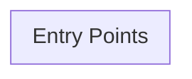

# Architecture — kube-prometheus

> Auto-generated on 2026-03-20. Update when adding modules, endpoints, or dependencies.

## Overview

| Property | Value |
|----------|-------|
| **Repository** | `GBI-Core/kube-prometheus` |
| **Language** | Go |
| **Framework** | github.com/prometheus-operator/kube-prometheus |
| **Default Branch** | `main` |
| **Dockerized** | No |
| **Protobuf/gRPC** | No |
| **Test Command** | `go test ./...` |

## High-Level Architecture



## Directory Structure

```
kube-prometheus/
├── developer-workspace/
│   ├── codespaces/
│   ├── common/
│   └── gitpod/
├── docs/
│   ├── customizations/
│   └── migration-example/
├── examples/
│   ├── basic-auth/
│   ├── continuous-delivery/
│   ├── example-app/
│   ├── jsonnet-build-snippet/
│   └── jsonnet-snippets/
├── experimental/
│   └── metrics-server/
├── jsonnet/
│   └── kube-prometheus/
├── manifests/
│   └── setup/
├── scripts/
├── tests/
│   └── e2e/
```

## Source Files

| Extension | Count |
|-----------|-------|
| `.yaml` | 121 |
| `.jsonnet` | 46 |
| `.go` | 3 |
| `.yml` | 1 |

## Entry Points

No standard entry points detected.

## CI/CD Workflows

- `ci.yaml`
- `claude-refactor.yml`
- `claude-review.yml`
- `claude-test-coverage.yml`
- `claude.yml`
- `kind`
- `stale.yaml`
- `versions.yaml`

## Key Decisions

_Populate with ADRs as decisions are made. Template: `.agent-base/.claude/guides/decisions/ADR-000-template.md`_

---

*Maintained as part of agent-base infrastructure.*
